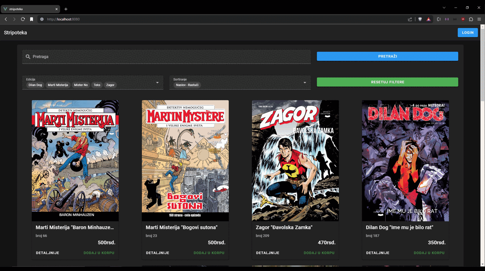

# MEVN Comicbook Store

A full-stack web application for managing a comic book store, built using the MEVN stack (MongoDB, Express.js, Vue.js, Node.js). This application allows users to browse and manage a collection of comic books.



## Table of Contents
- [Features](#features)
- [Technologies Used](#technologies-used)
- [Installation](#installation)
- [Usage](#usage)


## Features
- View a list of available comic books
- Add new comic books to the store
- Update existing comic books
- Delete comic books from the store
- User authentication and management

## Technologies Used
- Node.js
- Express.js
- MongoDB
- Vue.js
- Mongoose
- JWT Authentication

## Installation

To run the MEVN Comicbook Store application locally, follow these steps:

### 1. Clone the repository:
```bash
git clone https://github.com/JovanMihic99/MEVN-Comicbook-store.git
```

### 2. Navigate to the project directory:
```bash
cd MEVN-Comicbook-store
```

### 3. Install Backend dependencies:
Navigate to the `backend` folder and install the required dependencies:

```bash
cd backend
npm install
```

### 4. Install Frontend dependencies:
Navigate to the `frontend` folder and install the required dependencies:

```bash
cd frontend
npm install
```

### 5. Create a `.env` file:
In the `backend` directory, create a `.env` file to store your environment variables. The `.env` file should contain the following configuration:

```env
PORT=3500
MONGO_ATLAS_PW=[yourPassword]
JWT_KEY=[yourJWTKey]
```

You can customize the values such as `MONGO_URI` and `JWT_SECRET` based on your setup.

### 6. Run the Backend:
After installing the dependencies and configuring the `.env` file, navigate back to the `backend` directory and start the server:

```bash
cd backend
npm start
```

### 7. Run the Frontend:
After the backend is running, navigate back to the `frontend` directory and start the Vue.js development server:

```bash
cd frontend
npm run serve
```

The application will be available at `http://localhost:8080` (for the frontend) and `http://localhost:3000` (for the backend, unless configured differently).


## Usage

1. Navigate to `http://localhost:8080` in your browser to access the frontend.
2. Use the admin features to add, update, or delete comic books.
3. Use the user authentication system to register, login, and manage user sessions.


